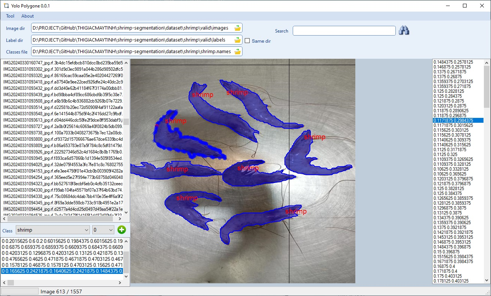

# YoloPolygon

<strong>YOLO Polygon</strong> là phần mềm do chúng tôi phát triển để đánh nhãn vật thể training segmentation. 

Với bài toán phát hiện đối tượng nằm cạnh nhau, có hình dạng không phải đa giác lồi có thể chồng chập lên nhau thì phải vẽ đường gấp khúc bao lấy đối tượng. Công cụ YOLO Polygon giúp các bạn đánh nhãn dễ dàng trên Windows. 

Đây là chương trình viết bằng ngôn ngữ C#, sử dụng .NET framework nên dễ dàng build và chỉnh sửa theo ý các bạn.

<strong>Đặc biệt: </strong>chương trình có full source code

Link: https://thigiacmaytinh.com/yolo-polygon-phan-mem-danh-nhan-yolo-segmentation-tren-windows